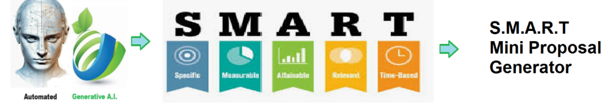

# Smart Mini Proposal - Creates a mini proposal using a template and SMART criteria.

## Description

Welcome to the solution **Smart Mini Proposal** - an example for your projects

Creates a mini proposal using a template and SMART criteria.

## Each Mini proposal contains:

1. **Objective** - Clearly state the purpose or goal of the proposal, outlining what you aim to achieve or address
2. **Scope** - Define the boundaries of the proposal, specifying what will be covered and what will not be addressed.
3. **Methodology** - Describe the approach or methods you intend to use to accomplish the objective, including any research or analysis techniques.
4. **Timeline** - Provide a timeline or schedule for the proposed activities, outlining key milestones and deadlines.
5. **Budget** - Estimate the resources required to execute the proposal, including costs associated with materials, personnel, and any other relevant expenses.

## Smart Criteria:

1. **specific** - Goals should be clear, concise, and focused on a specific outcome or result.
2. **measurable** - Goals should be quantifiable and include criteria for tracking progress and determining success.
3. **achievable** - Goals should be realistic and attainable within the constraints of resources, time, and capabilities.
4. **relevant** - Goals should align with overall objectives and be meaningful and relevant to the individual or organization.
5. **time-bound** - Goals should have a defined timeframe or deadline for completion, providing a sense of urgency and accountability.

    
## Features
- Easy to understand and use  
- Easily Configurable 
- Quickly start your project with pre-built templates
- Its Fast and Automated
    
## Notebook Features
- Self Documenting 
- Self Testing 
- Easily Configurable
- Includes Talking Code - The code explains itself
- Self Logging 
- Self Debugging 
- Low Code - or - No Code
- Educational 
    
#### https://github.com/JoeEberle/ -- josepheberle@outlook.com

    